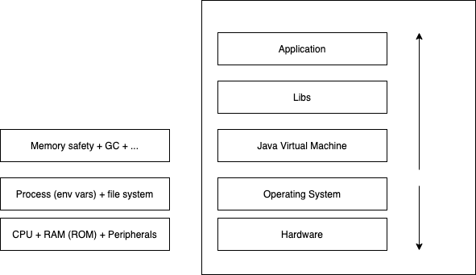

# Outline

## Week 1
### 07/10/2020 - Course introduction
* Syllabus, teaching methodology 
* [Evaluation](https://2021moodle.isel.pt/mod/page/view.php?id=121005)
* Bibliography
  * [Kotlin Apprentice (book)](https://www.amazon.com/Kotlin-Apprentice-Second-Beginning-Programming/dp/1950325008/ref=sr_1_1)
  * [Kotlin Home - language reference](https://kotlinlang.org/docs/reference/)
* [Lecture video (in Portuguese)](https://www.youtube.com/watch?v=Nf6Q5UQ6lDk&list=PL8XxoCaL3dBgXjxTLx4Fm-uxTD8k-cXQA&index=1)

## Week 2
### 12/10/2020 - The programmer's universe (introduction)

John Backus, [here](https://dl.acm.org/doi/pdf/10.1145/359576.359579)
> Underlying every programming language is a model
> of a computing system that its programs control.

* Tecnhology stacks and programming models

### 14/10/2020 - Representations
